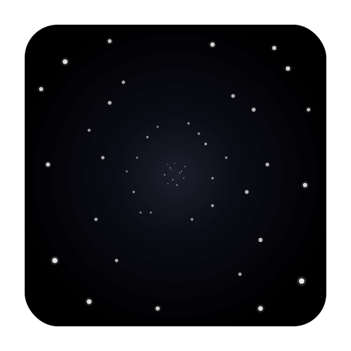
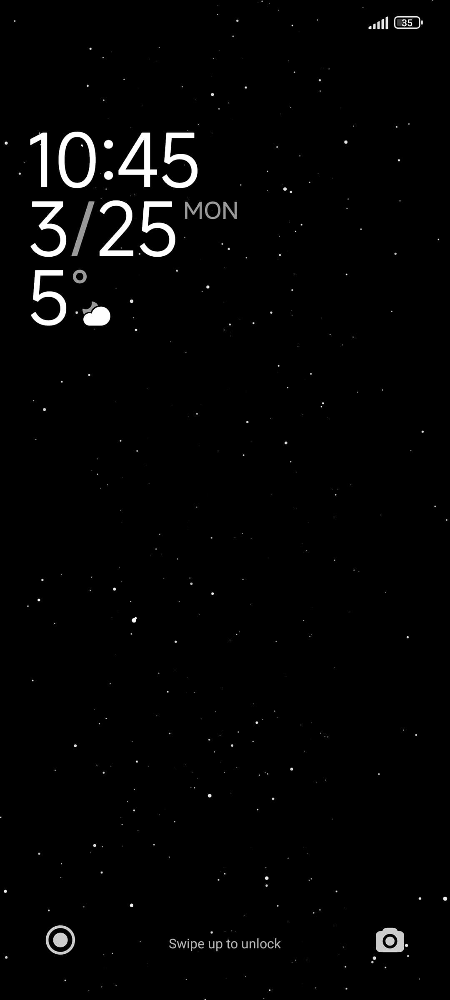
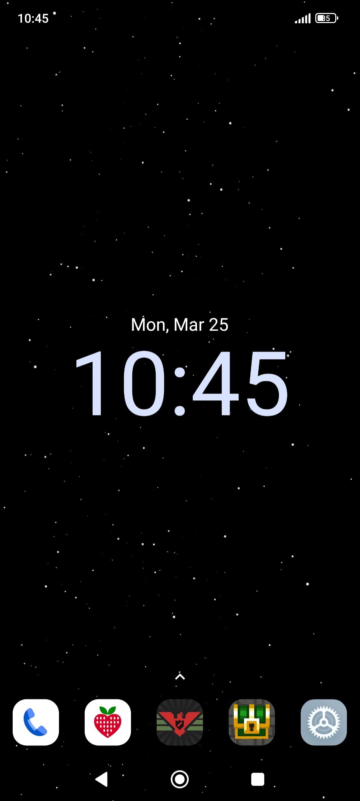
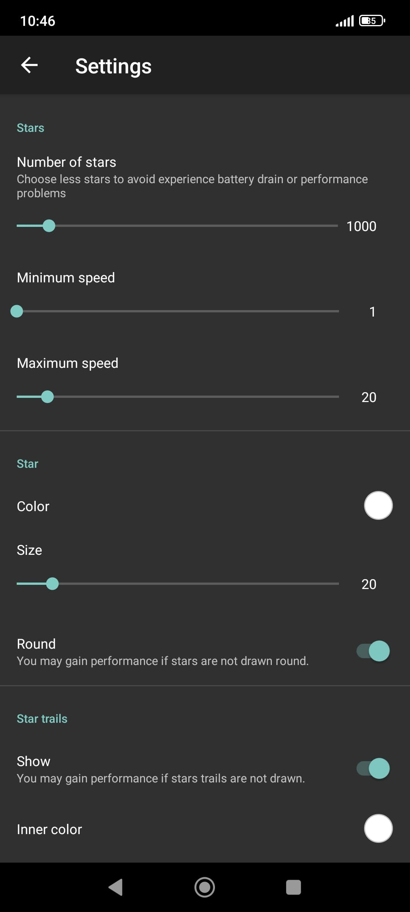

<div style="text-align:center"><a href="https://github.com/Safouene1/support-palestine-banner/blob/master/Markdown-pages/Support.md"></a></div>

---

<p align="center">
    <a href="https://ffalt.github.io" target="_blank">
        
    </a>
</p>

<h1 align="center">Starfield - Android Live Wallpaper</h1>
<p align="center">A lightweight, hardware accelerated, highly configurable live wallpaper that simulates a flight through a starfield.</p>

<p align="center">
  <a href="https://github.com/ffalt/starfield/releases" target="_blank"></a>
  <a href="https://opensource.org/license/gpl-3-0" target="_blank"></a>
  
</p>

## ✨ Features

Starfield focuses on smooth visuals and configurability without compromising battery life. Every aspect of the simulation can be tuned to match your taste - from a calm, drifting nebula feel to a blazing warp-speed rush.

| Category                  | What you get (most is optional)                                                      |
|---------------------------|--------------------------------------------------------------------------------------|
| 🌟 **Stars**              | Adjustable count, size, color, and min/max speeds                                    |
| 🔵 **Star shape**         | Toggle between smooth round circles and square pixels                                |
| 🚀 **Star acceleration**  | Each star naturally speeds up as it zooms toward you for a warp-rush feel            |
| ✨ **Star trails**         | Enable/disable motion trails; independent inner & outer gradient colors              |
| ☄️ **Meteors**            | Up to 3 simultaneous meteors spawning from any screen edge; configurable probability |
| 🌠 **Meteor detail**      | Multi-segment gradient trail, bright core streak, and glowing filled head            |
| 🎨 **Colors**             | Full color pickers for stars, trail inner/outer, and meteor head/tail                |
| 📱 **Screen follow**      | Tracks home-screen swiping with adjustable intensity; restore-to-center              |
| 🔄 **Gyroscope**          | Tilt-to-steer via gyroscope with adjustable intensity                                |
| 🔋 **Battery-aware**      | Automatically scales down star speed proportionally to battery level                 |
| ⚡ **Performance**         | Adjustable FPS cap; hardware-accelerated canvas rendering                            |
| 🌌 **Depth of field**     | Depth multiplier controls the perceived 3D parallax and zoom range                   |
| ⏸️ **Smart pause**        | Rendering stops automatically when the wallpaper is not visible - zero waste         |
| 🔐 **Boot-safe settings** | Preferences stored in device-protected storage; available before screen unlock       |
| 💾 **Settings**           | Persistent preferences with a one-tap Reset-to-defaults                              |

## 📸 Screenshots

<p align="center">
&nbsp; &nbsp;&nbsp; &nbsp;
</p>
<p align="center">
*Lock screen · Home screen wallpaper · Settings panel*
</p>

## 📲 Installation

No Play Store account needed - grab the APK directly:

<a href="https://github.com/ffalt/starfield/releases" target="_blank"></a>
<a href="https://apps.obtainium.imranr.dev/redirect?r=obtainium://app/%7B%22id%22:%22io.github.ffalt.starfield%22,%22url%22:%22https://github.com/ffalt/starfield%22,%22author%22:%22ffalt%22,%22name%22:%22Starfield%22,%22preferredApkIndex%22:%200%7D"  target="_blank"></a>

**Obtainium** lets you track and auto-update the app straight from this GitHub repository, so you'll always have the latest version without any app store.

### Quick-start after install

1. Long-press your home screen → **Wallpapers** → **Live Wallpapers**
2. Select **Starfield** from the list
3. Tap **Settings** to customise and enjoy 🚀

> [!Tip] 
> Starfield also installs a dedicated app icon in your launcher. Tap it any time to jump straight to the wallpaper - no need to dig through wallpaper menus.

## 🤝 Contribution & translation

All contributions are warmly welcome - no contribution is too small!

- 🐛 **Bug reports & ideas** - open an [issue](https://github.com/ffalt/starfield/issues)
- 🔧 **Code** - send a pull request with small, focused changes
- 🌍 **Translations** - help localise Starfield via Crowdin:  
  [crowdin.com/project/starfield-wallpaper](https://crowdin.com/project/starfield-wallpaper)


## ⚖️ License

This project is licensed under the **GPL 3.0** license. See [`LICENSE`](./LICENSE) for details.


## 🔨 Building from source

**Requirements:** Java JDK 11+, Android SDK, Gradle wrapper (already included)

```bash
# Clone the repository
git clone https://github.com/ffalt/starfield.git
cd starfield

# Build a debug APK
./gradlew assembleDebug

# (Optional) Install directly to a connected device via ADB
adb install -r app/build/outputs/apk/debug/app-debug.apk
```

> The project follows the standard Android Gradle layout - all app code lives under `app/src/main/`.


## 🙏 Acknowledgments

- Color picker UI by [jaredrummler/ColorPicker](https://github.com/jaredrummler/ColorPicker)

