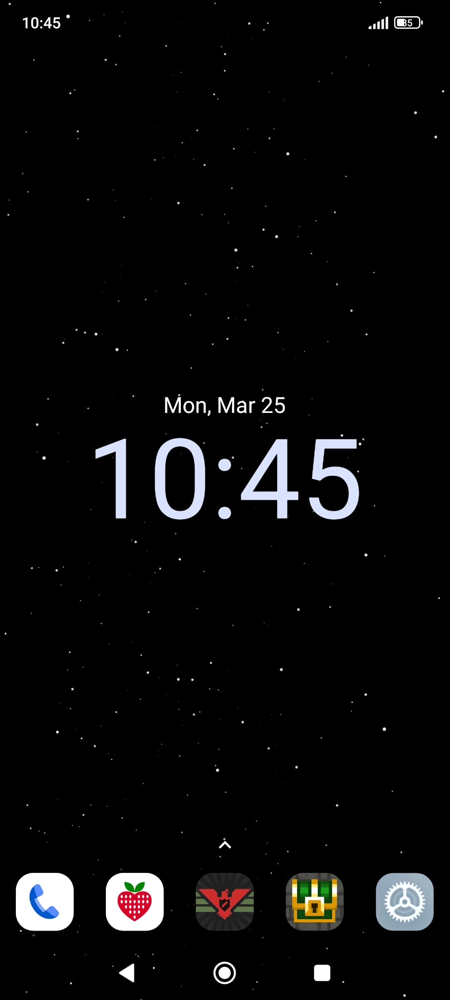

 

    

<h1 align="center">Starfield: Android Live Wallpaper</h1>
 

    
    

Want to help translate Starfield? Please use https://crowdin.com/project/starfield-wallpaper
 

## Description

Starfield is an Android live wallpaper that simulates a flight into a starfield.

## Screenshots

&nbsp; &nbsp;&nbsp; &nbsp;

## Features

Adjust a lot of aspects, e.g. star count, color, size, speed, trails, framerate

## License

This project is licensed under the GPL 3.0 license.

## Acknowledgments

This project uses https://github.com/jaredrummler/ColorPicker
